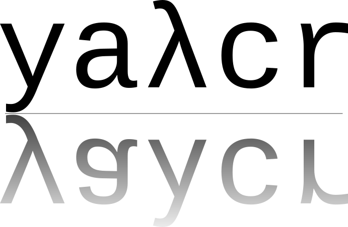

**yaλcr** (yalcr) is **Y**et **A**nother [**λ**-**C**alculus][lambda-calculus-wiki]
[**R**EPL][repl-wiki]. It only supports normal β-reduction at the moment.

[lambda-calculus-wiki]: https://en.wikipedia.org/wiki/Lambda_calculus
[repl-wiki]: https://en.wikipedia.org/wiki/Read%E2%80%93eval%E2%80%93print_loop
